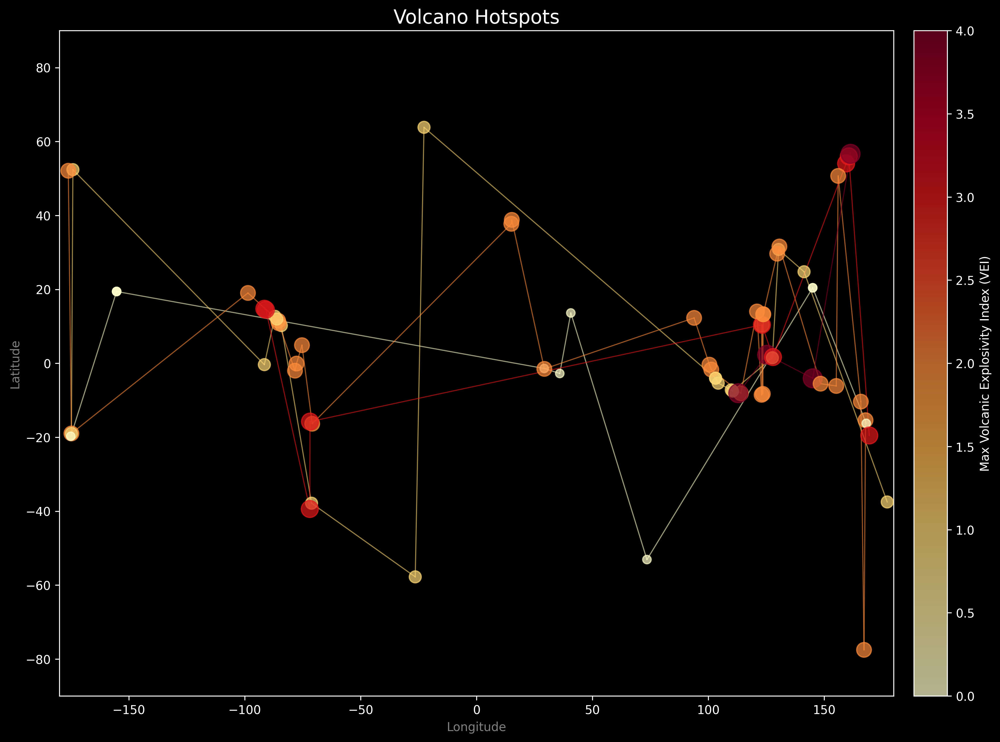

# Volcano Data Visualization

This project processes and visualizes volcano data from an Excel file, creating both static and interactive geographical plots. It identifies volcanoes by their Volcanic Explosivity Index (VEI) and plots them on a world map, styled to look like a celestial map of "hotspots."



---

## Features

- **Data Processing**: Reads data from an `.xlsx` file, cleans it, and saves it to a `.csv` file.
- **Static Visualization**: Generates a "starry sky" plot of volcano locations with:
  - A dark background.
  - Translucent circles representing volcanoes.
  - Size and color intensity (from yellow to red) based on the `Max VEI`.
  - Lines connecting volcanoes of the same intensity into "constellations."
- **Interactive Map**: Creates an HTML-based world map with clickable markers for each volcano.

---

## Project Structure

```
.
├── data/
│   └── output.csv              # Processed, clean CSV data
├── import_excel.py             # Script to process the initial Excel file
├── Volcanos Visualisation.py   # Main script to generate the static PNG visualization
├── create_world_map.py         # Script to generate the interactive HTML map
├── requirements.txt            # Project dependencies
├── Volcano Data.xlsx           # Original raw data file
└── README.md                   # This file
```

---

## Setup and Usage

### Prerequisites

- Python 3.8+
- `pip` for package management

### Installation

1.  **Clone the repository:**
    ```bash
    git clone https://github.com/drishtigh/Volcanos.git
    cd Volcanos
    ```

2.  **Install dependencies:**
    Create a virtual environment (recommended) and install the required packages.
    ```powershell
    # For Windows (PowerShell)
    python -m venv venv
    .\venv\Scripts\Activate.ps1
    python -m pip install -r requirements.txt
    ```

### Running the Scripts

1.  **Process the Data (Run this first):**
    This script reads `Volcano Data.xlsx` and creates `data/output.csv`, which is required by the other scripts.
    ```powershell
    python import_excel.py
    ```

2.  **Generate the Static Visualization:**
    This creates the main "hotspots" image (`volcano_hot_circles.png`).
    ```powershell
    python "Volcanos Visualisation.py"
    ```

3.  **Generate the Interactive Map:**
    This creates the interactive `volcano_world_map.html` file.
    ```powershell
    python create_world_map.py
    ```

---

## License

This project is licensed under the MIT License. See the `LICENSE` file for details.